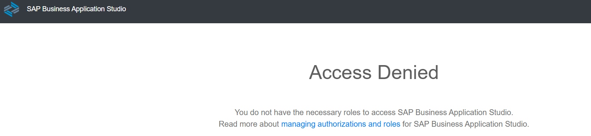
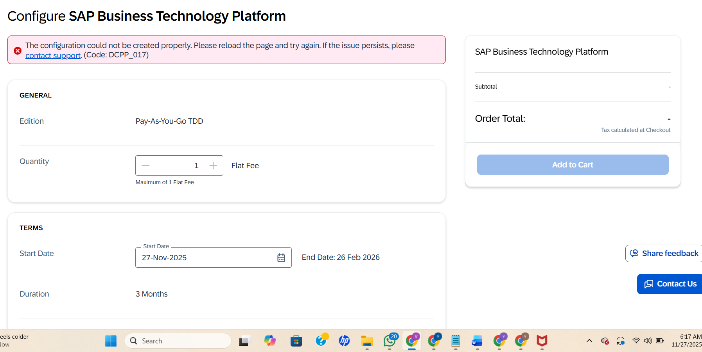

# sap-btp-free-tier-access-issue
I’m reaching out to the SAP Community for help, as I’m currently blocked in my SAP BTP learning journey. I’m facing issues like the DCPP_017 error, difficulty enabling the Free Tier with my university email, and BAS access denied. If anyone has faced similar problems or knows a workaround, your support would mean a lot. Kindly take a moment to review the issue summary I’ve included below. Thank you!

This repository contains detailed logs, screenshots, and steps of an SAP BTP Free Tier onboarding issue.   The goal is to help the SAP community diagnose the problem and assist learners who encounter similar errors while trying to access SAP Business Application Studio (BAS) using trial or free tier accounts.

#  Issue Summary

## Issue 1: BAS Access Denied in Trial Account

When navigating:
SAP BTP Cockpit → Services → Instances and Subscriptions → SAP Business Application Studio

#### I receive the following error:

Access Denied  
You do not have the necessary roles to access SAP Business Application Studio.

Multiple SAP community posts suggest that **BAS access is restricted in Trial**, and that switching to **Free Tier** resolves the problem.

#### What I Tried Next — SAP Free Tier Setup
I followed SAP’s official page:
Get an Account on SAP BTP to Try Out Free Tier Service Plans

#### But two new issues appeared:
## Issue 2: Personal Email Not Allowed for Free Tier
When attempting to convert/join Free Tier:

To access SAP Free Tier, personal email domains are not allowed.  
Please use a company or university email.

I used my University email (even though I already graduated).

## Issue 3: Account Creation Failure (DCPP_017 Error)
After entering the required details using my university email, the process fails with:

I retried several times—same error.

#  Support Ticket
I raised a support request through the SAP community.
It has been 3 days with no response yet.

# Request for Community Help
If anyone has:

#### 1. Faced similar errors
#### 2. Solved DCPP_017
#### 3. Successfully enabled Free Tier using university email
#### 4. Has insights into BAS access limitations

Your guidance will truly help me continue my SAP learning journey.

Thank you in advance!
